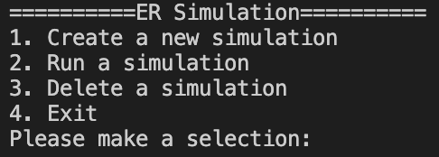
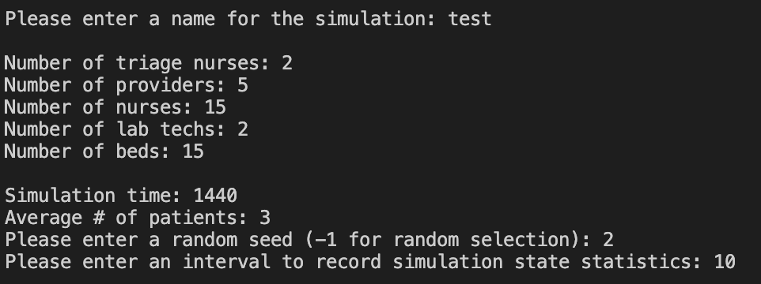
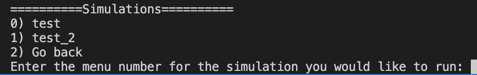
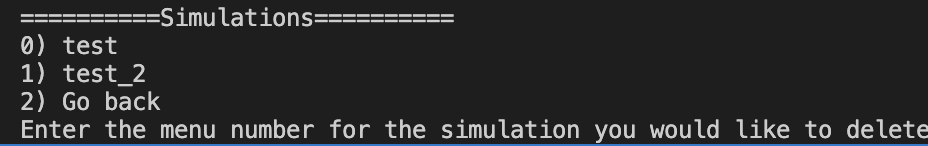
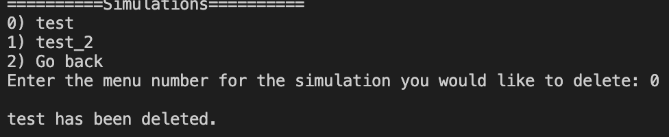
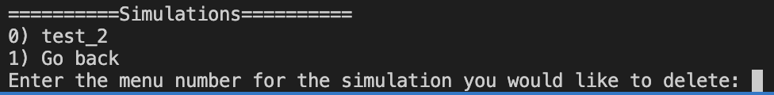
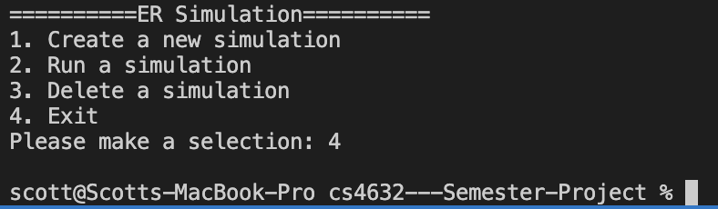
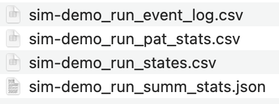

# 🏥Emergency Room Discrete Event Simulation🏥
CS 4632 Semester Project - 
Scott Coleman - Red Hot Data Analysts

## ✍️Project Description📜
This project implements a discrete event simulation of an ER. The motivation behind this project is to model patient flow and resource utilization in order to analyze overall ER performance.

The simulation includes core ER processes such as:
* Patient arrival
* Triage
* Bed assignment
* Provider evaluation
* Treatment and discharge

## ⚙️Installation Instructions📝
The following is needed in order to run this project:
* Python 3.10+
* An IDE (VS Code is recommended)

**Steps**
1. Clone or download this repository
2. Open the project folder in preferred IDE
3. Verify Python configuration

## 📝Usage▶️
1. Open Main.py
2. Run the file

A console menu will be displayed:
* Option 1: Create a simulation job
* Option 2: Run a simulation job
* Option 3: Delete a simulation job
* Option 4: Exit the program

Some important things to note:
* Output files with simulation results will be available in the project folder
* Option 1 must be selected and completed in order for option 2 and 3 to have any useful functionality

## 🧱Simulation Parameters🧰
* Simulation name: Meaningful name to orgranize simulation outputs
* Number of Resources:
  - Nurses, Providers, Beds, Lab Technicians
  - Controls the available staff and resource pool
* Simulation time: The total amount of time to run the simulation for in minutes
* Arrival Rate: Used to set the patient average number of patients arriving to the ER per hour
* Random seed: Used to keep random number generators consistent across each component of the simulation
* Stats interval: Time steps to record state metrics of the simulation

## 📜Architecture Overview👷
* **Core Engine**
  - Simulation.py
    + Controls simulation clock
    + Executes events
    + Manages event loop
  - Main.py
    + Handles parameter input
    + Creates and starts simulation jobs

* **Supporting Components**
  - EventList.py: Manages scheduling and retrieval of events
  - Event.py: Defines event types
    + Uses inheritance for flexibility
  - Patient.py: Represents patient entities

* **Resource and Queue Management**
  - ResourceManager.py
    + Handles resource allocation (seize/release)
    + Resource tracking using stacks
  - QueueManager.py
    + Manages queues for each station
  - DataStructures.py
    + Contains custom implementations of FIFO and Priority Queue as well as Stack

* **Additional Components**
  - Resource.py
    + Defines resource types
    + Uses inheritance for flexibility
  - TriagePolicy.py
    + Defines logic assigning patient ESI level
  - StatsCollector.py
    + Handles collection of metrics
    + Computes key statistics
    + Create output files

## 🧑‍🔬Example Outputs🧑‍💻

- Main menu displayed to the user on the console.

- After selecting option 1 the user is prompted to enter values for each of the parameteres.

- Selecting option 2 displays all simulation jobs that have been created. Entering the menu number for a simulation executes the simulation.

- Selecting option 3 displays all simulation jobs. Entering the menu number for a simulation deletes that simulation job. This can not be undone.

- Output after selecting 'test' to be deleted.

- Confirmation showing that 'test' has been deleted.

- Upon selecting option 4 the program is terminated.

 
- Example of output files within the project folder.

## 🎉Project Status🎉
The simulation is finally complete and ready for use!
